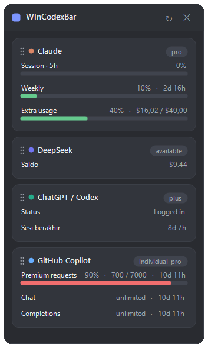
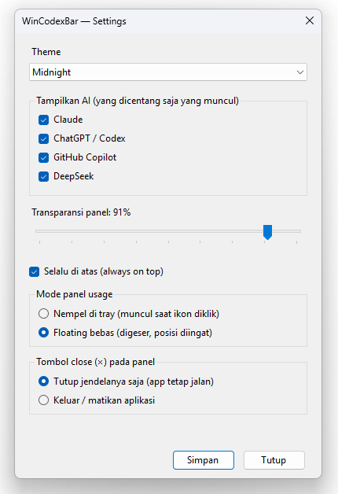

<h1 align="center">WinCodexBar</h1>

<p align="center">
  A lightweight Windows system-tray app that shows your <b>AI usage at a glance</b> —
  Claude, ChatGPT / Codex, GitHub Copilot, and DeepSeek — in one tidy popup.
</p>

<p align="center">
  
  
  
  
</p>

<p align="center">
  
  &nbsp;&nbsp;
  
</p>

> A Windows port, in spirit, of the macOS **[CodexBar](https://github.com/steipete/CodexBar)** — same idea, native WinForms.

---

## ✨ Features

- **One-glance usage panel** — session / weekly quota bars, reset countdowns, plan, and pay-as-you-go spend.
- **Four providers in one place** — Claude, ChatGPT / Codex, GitHub Copilot, and DeepSeek.
- **Sign in from your browser** — no manual token pasting for Copilot & ChatGPT (OAuth / device flow).
- **5 themes** — Midnight, Slate, Indigo, Forest, and Light.
- **Drag to reorder** — arrange the provider cards however you like; the order is remembered.
- **Show / hide providers** — pick which AIs appear, even when you're logged into all of them.
- **Close button, your way** — the × either just hides the panel or quits the app (your choice in Settings).
- **Tray-native** — a tiny coloured bar icon that tints by your highest utilization; left-click for the panel, right-click for the menu.
- **Customisable panel** — adjustable transparency, always-on-top, and either *dock to tray* or *free-floating* (drag anywhere, position remembered; multi-monitor aware).
- **Manual refresh** — the ↻ button in the panel, plus auto-refresh on an interval.

## 🔌 Providers & how they connect

| Provider | How it authenticates |
| --- | --- |
| **Claude** (Pro / Max) | Reuses the token the **Claude Code** CLI already stores in `~/.claude/.credentials.json`, then calls Anthropic's usage API. When the token expires it is refreshed automatically via *delegated refresh* (it runs the official Claude Code CLI). A `claude.ai` `sessionKey` can be pasted as a fallback. |
| **ChatGPT / Codex** | "Sign in with ChatGPT" — browser OAuth (PKCE) on a localhost loopback. Shows plan and login status. |
| **GitHub Copilot** | GitHub device-flow login (open the URL, enter the code), then reads quota snapshots. |
| **DeepSeek** | Paste an API key (tray → Login → DeepSeek, or `config.json`). Shows the prepaid account balance/credits. |

> ⚠️ The Claude and ChatGPT endpoints used here are **unofficial / undocumented** (the same ones the official desktop tools use internally) and may change without notice.

## 🚀 Build & run

Requirements: Windows 10/11 and the [.NET SDK](https://dotnet.microsoft.com/download) (8.0 or newer).

```bash
git clone https://github.com/lililomo/WinCodexBar-Simple.git
cd WinCodexBar-Simple
dotnet run
```

Or grab a ready-to-run build from the [Releases](https://github.com/lililomo/WinCodexBar-Simple/releases) page (no .NET install needed).

An icon appears in your system tray. Right-click it → **Login** to connect a provider.

## ⚙️ Configuration

Settings live in `%AppData%\WinCodexBar\config.json` (created on first run). Most options are also in the
tray's **Settings…** dialog:

- **Theme** — Midnight / Slate / Indigo / Forest / Light
- **Show / hide** each provider
- **Transparency** of the panel (20–100%)
- **Always on top**
- **Panel mode** — *anchored to tray* or *free-floating*
- **Close (×) button** — hide the window, or quit the app
- `RefreshSeconds` — auto-refresh interval (default `300`)

Tip: drag a card up or down in the panel to reorder providers.

## 🙏 Credits

- Inspired by **[CodexBar](https://github.com/steipete/CodexBar)** by [@steipete](https://github.com/steipete).
- Built with .NET WinForms.

## 📄 License

[MIT](LICENSE)
